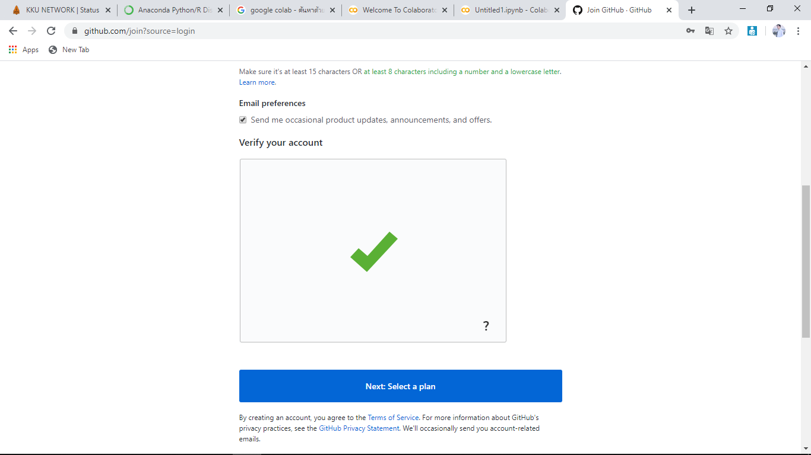

# Python_datavizz การบ้านที่1
# นายพงศ์ศิริเดช ศิลปษา รหัส 603021874-8 สาขาสารสนเทศสถิติ
# ขอบเขตการนำเสนอ
1 การ install Python ลงเครื่อง

2 การใช้งาน Colab

3 การใช้งาน github

# 1 การ install Python ลงเครื่อง

ขั้นตอนที่ 1 ก่อนอื่นให้พิมพ์ค้นหาใน google ว่า anaconda python download จากนั้นให้กดเลือกเข้าเว็บไซต์ [Anaconda Python/R Distribution - Free Download](https://www.anaconda.com/distribution/) เพื่อเข้าไปดาวน์โหลด version ที่เราต้องการ ดังรูปภาพ

ขั้นตอนที่ 2 เมื่อการดาวน์โหลดเสร็จสิ้นแล้วก็ให้ทำการติดตั้งโปรแกรมทันที (ดูวิธีการติดตั้งได้จาก [ที่นี่](https://medium.com/@saichonjaiyen/%E0%B8%81%E0%B8%B2%E0%B8%A3%E0%B8%95%E0%B8%B4%E0%B8%94%E0%B8%95%E0%B8%B1%E0%B9%89%E0%B8%87-anaconda-%E0%B8%9A%E0%B8%99-windows-4dbf02068792))
จากนั้นเมื่อการติดตั้งเสร็จสิ้นก็ให้เราค้นหาโปรแกรม Anaconda Prompt โดยการ search box (รูปแว่นขยายที่อยู่มุมซ้ายล่างของหน้าจอ)

ขั้นตอนที่ 3 ให้เปิด Anaconda Prompt ขึ้นมาจะพบหน้าต่างดังรูป

ขั้นตอนที่ 4 สามารถเช็คดู version ของ Python ที่เราติดตั้งได้โดยการพิมพ์ python แล้วกด Enter จะได้ดังรูป

# 2 การใช้งาน Colab

ขั้นตอนที่ 1 พิมพ์ค้นหาใน Google ว่า Google colab จากนั้นให้เลือกเว็บไซต์ [Google Colab](https://colab.research.google.com/notebooks/welcome.ipynb) ที่อยู่อันแรกดังรูปภาพ
 

ขั้นตอนที่ 2 ให้ทำการเลือก Sign in ที่อยู่บนมุมขวามือของรูปภาพ
 

ขั้นตอนที่ 3 จากนั้นให้ทำการ sign in โดยใช้ email ของตัวเอง
 

ขั้นตอนที่ 4 เมื่อเราทำการ sign in เสร็จเรียบร้อยแล้วจะปรากฏหน้าแรกดังรูปภาพ จากนั้นหากต้องการจะเขียนโค้ดให้คลิกไปที่ file > New Python3 Notebook ดังรูป
 
 
# ***เราสามารถตั้งค่าตบแต่งหน้าเว็บของ colab ได้ดังรูปภาพ
 
 

# 3 การใช้งาน Github

ขั้นตอนที่ 1 

