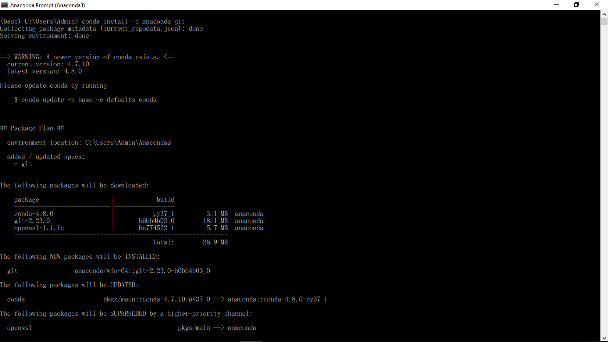
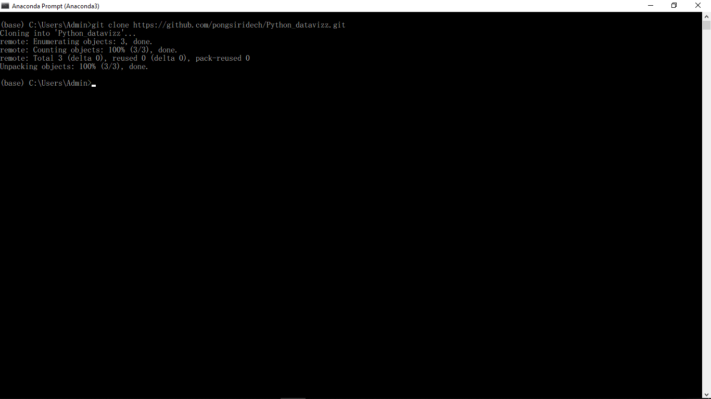

# Python_datavizz การบ้านที่1
# นายพงศ์ศิริเดช ศิลปษา รหัส 603021874-8 สาขาสารสนเทศสถิติ
# ขอบเขตการนำเสนอ
1 การ install Python ลงเครื่อง

2 การใช้งาน Colab

3 การใช้งาน github

# 1 การ install Python ลงเครื่อง

ขั้นตอนที่ 1 ก่อนอื่นให้พิมพ์ค้นหาใน google ว่า anaconda python download จากนั้นให้กดเลือกเข้าเว็บไซต์ [Anaconda Python/R Distribution - Free Download](https://www.anaconda.com/distribution/) เพื่อเข้าไปดาวน์โหลด version ที่เราต้องการ ดังรูปภาพ

ขั้นตอนที่ 2 เมื่อการดาวน์โหลดเสร็จสิ้นแล้วก็ให้ทำการติดตั้งโปรแกรมทันที (ดูวิธีการติดตั้งได้จาก [ที่นี่](https://medium.com/@saichonjaiyen/%E0%B8%81%E0%B8%B2%E0%B8%A3%E0%B8%95%E0%B8%B4%E0%B8%94%E0%B8%95%E0%B8%B1%E0%B9%89%E0%B8%87-anaconda-%E0%B8%9A%E0%B8%99-windows-4dbf02068792))
จากนั้นเมื่อการติดตั้งเสร็จสิ้นก็ให้เราค้นหาโปรแกรม Anaconda Prompt โดยการ search box (รูปแว่นขยายที่อยู่มุมซ้ายล่างของหน้าจอ)

ขั้นตอนที่ 3 ให้เปิด Anaconda Prompt ขึ้นมาจะพบหน้าต่างดังรูป

ขั้นตอนที่ 4 สามารถเช็คดู version ของ Python ที่เราติดตั้งได้โดยการพิมพ์ python แล้วกด Enter จะได้ดังรูป

# 2 การใช้งาน Colab

ขั้นตอนที่ 1 พิมพ์ค้นหาใน Google ว่า Google colab จากนั้นให้เลือกเว็บไซต์ [Google Colab](https://colab.research.google.com/notebooks/welcome.ipynb) ที่อยู่อันแรกดังรูปภาพ
 

ขั้นตอนที่ 2 ให้ทำการเลือก Sign in ที่อยู่บนมุมขวามือของรูปภาพ
 

ขั้นตอนที่ 3 จากนั้นให้ทำการ sign in โดยใช้ email ของตัวเอง
 

ขั้นตอนที่ 4 เมื่อเราทำการ sign in เสร็จเรียบร้อยแล้วจะปรากฏหน้าแรกดังรูปภาพ จากนั้นหากต้องการจะเขียนโค้ดให้คลิกไปที่ file > New Python3 Notebook ดังรูป
 
 
# ***เราสามารถตั้งค่าตบแต่งหน้าเว็บของ colab ได้ดังรูปภาพ
 
 

# 3 การใช้งาน Github

ขั้นตอนที่ 1 พิมพ์ค้นหาคำว่า www.github.comlogin ใน Google จากนั้นให้เลือกไปที่เว็บแรกสุดดังรูปภาพ ([
Login - GitHub](https://github.com/))

ขั้นตอนที่ 2 ให้ทำการสมัครสมาชิกโดยการคลิกไปที่ Create an account

2.1 จากนั้นให้เรากรอกข้อมูลให้เรียบร้อย

2.2 ทำการคลิกใช้ฟรี

2.3 จากนั้นให้ไปยืนยันตัวตนตามที่อยู่ของ email ที่เราใช้สมัคร จากนั้นคลิกไปที่คำว่า verify email address ดังรูปภาพ

ขั้นตอนที่ 3 หลังจากที่ทำการยืนยันตัวตนเรียบร้อยแล้ว หน้าจอจะเด้งกลับมาที่แรกของเว็บไซต์ ให้เราทำการคลิกไปที่สัญลักษณ์รูปบวกที่อยู่ด้านบนขวามือแล้วกดเลือกไปที่ New repository ดังรูป

ขั้นตอนที่ 4 หน้าจอจะเด้งไปที่หน้าจอการสร้างโปรเจ็ค ให้เรากรอกรายละเอียดตามที่เราต้องการ (ในกรณีนี้ได้ตั้งชื่อว่า python_dataviz) จากนั้นให้คลิกที่ public เพื่อเปิดเป็นแบบสาธารณะ
 จากนั้นจึง Create repository ดังรูป

4.1 หน้าจอจะเด้งไปที่หน้า Github ดังรูป

ขั้นตอนที่ 5 ทำการ install github ในโปรแกรม Anaconda prompt โดยใช้คำสั้ง conda install -c anaconda git ดังรูป

ขั้นตอนที่ 6 ทำการ link ระหว่างหน้าเว็บGithub กับ คอมพิวเตอร์ของเรา โดยการคลิกไปที่ไอคอนสีเขียว clone or download จากนั้นคลิกไปที่สัญลักษณ์ Copy url ดังรูป

ขั้นตอนที่ 7 พิมพ์คำสั่งของ Github ลงใน Anaconda prompt โดยเริ่มจากคำสั่ง git clone แล้วตามด้วย url ที่เราได้ Copy มาจากขั้นตอนที่แล้ว ดังรูป

7.1 จากนั้นพิมพ์ cd ตามด้วยชื่อโฟลเดอร์ python_dataviz (โฟลเดอร์นี้จะปรากฏขึ้นอัตโนมัติเมื่อเราทำการ link เว็บ github กับ คอมพิวเตอร์ของเรา)

7.2 จากนั้นทำการตรวจเช็คว่ามีไฟล์ใดบ้างที่อยู่ในโฟลเดอร์แต่ไม่ได้เชื่อมต่อกับ git โดยการใช้คำสั่ง git status หากมีไฟล์ใดที่ยังไม่ได้เชื่อมต่อกับ git ตัวหนังสือจะเป็นสีแดง ดังรูป

7.3 จากนั้นให้ใช้คำสั่ง git add "..." ในการเชื่อมไฟล์ไปยัง git (ในช่องว่างให้เติมชื่อไฟล์ที่เป็นสีแดง)ดังรูป

7.4 จากนั้นให้ใช้คำสั่ง git commit -m "test git" เพื่อบอกว่าเรากำลังทำอะไรอยู่ ดังรูป

7.5 จากนั้นใช้คำสั่ง git push เพื่ออัพงานเข้า github โดยการอัพงานจะต้องใช้ Username และ Password ทุกครั้ง

# เพียงเท่านี้ก็เสร็จเรียบร้อย

# เพิ่มเติม การดาวน์โหลด visual studio code

พิมพ์ค้นหาใน google ว่า visual studio code จากนั้นให้เลือกเว็บไซต์แรกสุด ดังรูป ([Visual Studio Code - Code Editing. Redefined](https://code.visualstudio.com/)) ดังรูป

คลิกไปที่ไอคอนสีน้ำเงิน Download for windows จากนั้นจึงทำการติดตั้ง

